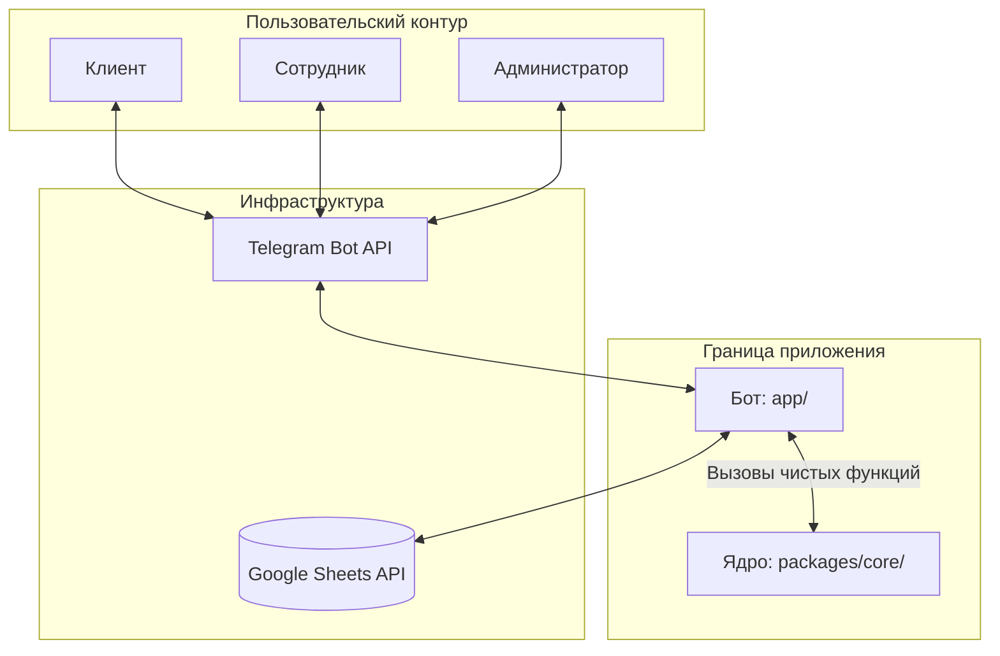

# 🏢 OTDEL: Telegram-based HRM & Task Manager

   

> Инженерный артефакт: Система управления задачами и заказами контент-агентства «Otdel» и HRM-модуль для сотрудников, полностью интегрированный в Telegram и использующий Google Sheets в качестве распределенной СУБД.

---

# 📑 Содержание (Table of Contents)

1. 💡 [Описание предметной области и спецификация](#1-описание-предметной-области-и-спецификация-domain--specification)
2. 🏗️ [Архитектурное описание системы](#2-архитектурное-описание-системы-architectural-overview)
3. 🗺️ [Визуализация архитектуры (Диаграммы)](#3-визуализация-архитектуры-diagrams)
4. 🗄️ [Архитектура Базы Данных (Google Sheets)](#4-архитектура-базы-данных-google-sheets-схема-таблиц)
5. 🚀 [Быстрый старт и Развертывание (Deployment)](#5-быстрый-старт-и-развертывание-deployment-guide)
6. 📂 [Структура репозитория](#6-структура-репозитория-repository-layout)
7. ⚙️ [Автоматизация (Makefile)](#7-автоматизация-единая-поверхность-команд-makefile)
8. 🧪 [Стратегия тестирования](#8-стратегия-тестирования-testing-strategy)
9. 🐋 [Контейнеризация (Docker)](#9-контейнеризация-и-локальная-инфраструктура)
10. 📄 [Лицензия](#10-лицензия-license)

---

# 1. Описание предметной области и спецификация (Domain & Specification)

Система предназначена для автоматизации операционной деятельности контент-агентства. В качестве распределенной СУБД используется Google Sheets, что позволяет менеджерам вести учет в привычном интерфейсе.

## 1.1. Роли пользователей (Actors)

* **Клиент / Заказчик:** Формирует корзину услуг, выбирает юридическую форму и оформляет заказ.
* **Сотрудник / Исполнитель:** Просматривает свои задачи, отмечает их выполнение и следит за заработком.
* **Администратор:** Создает задачи, распределяет их по проектам и имеет доступ к аудиту (логам).

---

# 2. Архитектурное описание системы (Architectural Overview)

Архитектура спроектирована по принципу разделения ответственности, изолируя бизнес-логику от механизмов доставки (Telegram I/O).

1. **Запускаемое приложение (`app/`)**
   Асинхронное Telegram-приложение. Отвечает за Event Loop, маршрутизацию сообщений, FSM (`states.py`) и адаптеры внешней БД (`sheets.py`).

2. **Переиспользуемое ядро (`packages/core/`)**
   Чистая библиотека с бизнес-логикой (корзина, валидация). Полностью изолирована от Telegram API и сети.

---

# 3. Визуализация архитектуры (Diagrams)

## Диаграмма контекста



---

# 4. Архитектура Базы Данных (Google Sheets): Схема таблиц

Для корректной работы системы используется Google Sheets как распределенная база данных.

⚠️ Важно:
При первом запуске система автоматически создает и размечает все необходимые листы через `init_db.py`.

---

# 5. Быстрый старт и Развертывание (Deployment Guide)

## Шаг 1: Получение токена Telegram

1. Напишите в Telegram боту `@BotFather`
2. Создайте нового бота командой `/newbot`
3. Скопируйте полученный `Token API`

---

## Шаг 2: Создание Базы Данных

1. Создайте **новую пустую таблицу** в Google Sheets.
2. Скопируйте **Spreadsheet ID** из адресной строки браузера (символы между `/d/` и `/edit`).
3. (Вручную ничего заполнять не нужно, скрипт сделает это за вас на этапе запуска).

---

## Шаг 3: Настройка Google Cloud Service Account

Бот общается с таблицей от лица технического аккаунта.

1. Зайдите в Google Cloud Console.
2. Включите Google Sheets API в вашем проекте.
3. Создайте Service Account и сгенерируйте для него ключ в формате JSON.
4. Скачайте этот файл, переименуйте его в `service_account.json` и положите в корень проекта.
5. Откройте `service_account.json`, скопируйте email из поля `client_email`.
6. Выдайте этому email'у права **Редактора** в вашей Google Sheets таблице.

---

## Шаг 4: Настройка config.py

Откройте файл `app/config.py` и вставьте свои данные:

```python
BOT_TOKEN = "ВАШ_ТОКЕН_ИЗ_ШАГА_1"
SPREADSHEET_ID = "ВАШ_ID_ТАБЛИЦЫ_ИЗ_ШАГА_2"
SERVICE_ACCOUNT_FILE = "service_account.json"

# Telegram ID сотрудников
ALLOWED_TELEGRAM_IDS = [111222333, 444555666]

EMPLOYEE_NAMES = {
    111222333: "Иван Иванов (Админ)",
    444555666: "Анна Смирнова",
}

ADMINS = [111222333]
```

---

## Шаг 5: Инициализация БД и Запуск проекта

Перед первым запуском необходимо разметить пустую таблицу в Google Sheets (скрипт создаст нужные листы и пропишет столбцы):

```bash
make init-db
```

После успешной инициализации запустите проект:

```bash
make compose-up
```

---

# 6. Структура репозитория (Repository Layout)

```plaintext
.
├── app/
│   ├── bot.py
│   ├── handlers.py
│   ├── sheets.py
│   ├── config.py
│   ├── states.py
│   └── init_db.py                # Скрипт автоматической разметки БД
├── packages/core/
│   └── cart.py
├── tests/
│   └── test_cart.py
├── logs/
├── service_account.json          # Ключ Google Cloud (создается пользователем локально)
├── Dockerfile
├── compose.yaml
├── Makefile
├── requirements.txt
└── README.md
```

---

# 7. Автоматизация (Makefile)

| Команда             | Назначение                             |
| ------------------- | -------------------------------------- |
| `make run`          | Локальный запуск приложения            |
| `make init-db`      | Инициализация и разметка Google Sheets |
| `make test`         | Запуск unit-тестов                     |
| `make check`        | Сквозная верификация проекта           |
| `make compose-up`   | Сборка и запуск контейнера             |
| `make compose-down` | Остановка контейнера                   |
| `make clean`        | Очистка временных файлов               |

---

# 8. Стратегия тестирования (Testing Strategy)

Тесты сфокусированы на верификации стабильности переиспользуемого ядра `packages/core/cart.py`.

Они полностью изолированы от:

* сети,
* Telegram API,
* Google Cloud API.

Верифицируются:

* позитивные сценарии добавления услуг,
* негативные сценарии,
* корректность инкремента количества,
* мутация структур данных корзины.

---

# 9. Контейнеризация и локальная инфраструктура

Проект использует легковесный Docker-образ:

```plaintext
python:3.11-slim
```

Для сохранения диагностических данных используется Volume-монтирование:

```plaintext
./logs -> /logs
```

Это предотвращает потерю логов при пересоздании контейнеров.

---

# 10. Лицензия (License)

Проект распространяется под лицензией MIT License.

```text
Copyright (c) 2026 Контент-агентство «Otdel»

Permission is hereby granted, free of charge, to any person obtaining a copy
of this software and associated documentation files (the "Software"), to deal
in the Software without restriction, including without limitation the rights
to use, copy, modify, merge, publish, distribute, sublicense, and/or sell
copies of the Software.

THE SOFTWARE IS PROVIDED "AS IS", WITHOUT WARRANTY OF ANY KIND.
```
